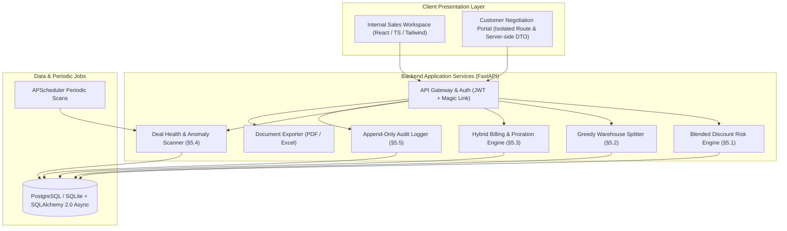

# DealFlow360 — Intelligent, Self-Governing Sales Operations Platform

> **Quote → Approval → Fulfillment → Hybrid Billing → Portal Negotiation → Reporting**

DealFlow360 is an enterprise sales operations engine built to enforce pricing discipline, react dynamically to inventory realities, reconcile subscriptions and one-time hardware sales on unified orders, and empower customers with live, negotiable portal quotations.

---

## 1. System Architecture



### Strict Customer Portal Isolation
The customer portal operates on a dedicated route group (`/portal?token=...`) with server-side response models (`PortalQuotationOut`). Cost prices, internal margins, approval thresholds, and audit notes are stripped **on the backend** and never transmitted over the wire.

---

## 2. Core Business Logic Engines

### §5.1 Blended Discount Risk Engine
Evaluates every line item against the stricter of customer tier ceilings and product category ceilings:
$$\text{allowed} = \min(\text{tier\_ceiling}[\text{customer.tier}], \text{category\_ceiling}[\text{line.product.category}])$$
$$\text{excess} = \max(0, \text{line.discount\_pct} - \text{allowed})$$
$$\text{max\_excess} = \max(\text{line excesses}), \quad \text{total\_excess} = \sum(\text{line excesses})$$

- **NONE**: Within allowable limits $\rightarrow$ direct approval.
- **MEDIUM**: $\text{max\_excess} \le 5\%$ $\rightarrow$ routes to **Sales Manager** (Step 1).
- **HIGH**: $\text{max\_excess} > 5\%$ or $\text{total\_excess} > 8\%$ $\rightarrow$ routes to **Sales Manager** then **Finance/Ops** (Step 2).

### §5.2 Greedy, Cost-Weighted Warehouse Allocation
- Evaluates stock across active depots ordered by `shipping_cost_weight ASC`.
- First attempts a single-depot fulfillment to minimize shipments to 1.
- If order exceeds single depot capacity, greedily assigns available inventory from the cheapest depot first and logs remaining units to `BackorderLine`.
- Detects stock replenishment and offers a one-click **"Consolidate Remaining Backorders"** action.

### §5.3 Hybrid Billing & Mid-Cycle Subscription Proration
- Strict policy: **Invoice per shipment** — physical hardware is never invoiced prior to dispatch.
- Evaluates mid-cycle seat/plan adjustments:
  $$\text{daily\_rate} = \frac{\text{plan.price}}{\text{cycle\_length\_days}}$$
  $$\text{proration\_delta} = (\text{new\_daily\_rate} - \text{old\_daily\_rate}) \times \text{remaining\_days}$$
- Automated generation of credit notes or additional charges.

### §5.4 Deal Health & Anomaly Scanners
- **Stalled Deals**: Quotes inactive for $> 7$ days in negotiation or draft stages.
- **Discount Anomalies**: Deals where discount exceeds $1.4\times$ the sales rep's historical trailing average.
- **Logistics Slippage**: Fulfillment orders exceeding estimated dispatch dates without carrier shipment.

---

## 3. Quick Test Flow Walkthrough (8-Step Official Verification)

| Step | Flow Description | Verification Outcome in DealFlow360 |
|---|---|---|
| **1** | Login and verify basic configuration data | `Admin Config` shows Gold (15%), Silver (10%), Bronze (5%) ceilings, Chicago & NYC depots, and Monthly SaaS plans. |
| **2** | Create quotation with over-normal discount | Add **Setup Service** with 18% discount (allowed is only 10% for Gold) $\rightarrow$ Line turns **OVER (+8%)** immediately. |
| **3** | Submit quotation without manual routing request | Quote automatically flags as **HIGH RISK** and auto-routes to Sales Manager $\rightarrow$ Finance. |
| **4** | Accept upsell suggestion while building quote | Add recommended **Pro Docking Station** $\rightarrow$ Order total and gross margin update in real time. |
| **5** | Approve quotation and evaluate warehouse split | Order for 6 laptops splits automatically: **4 from Main Warehouse (Chicago)** + **2 from East Depot (NYC)**. |
| **6** | Hybrid order billing separation | One-time hardware and recurring cloud subscription lines are displayed, invoiced, and tracked independently. |
| **7** | Customer portal counter-discount negotiation | Customer proposes 18% counter-discount in `/portal` $\rightarrow$ Quote automatically re-enters **pending_approval**! |
| **8** | Dispatch shipment, record payment, and reconcile | Dispatching fulfillment creates invoice; recording full payment updates status to **PAID**. |

---

## 4. Running the Application

### Option A: Direct Local Startup (Fastest & Zero Setup)
Make sure Python 3.10+ and Node.js 18+ are installed.

```bash
# Windows
start.bat

# Linux / Mac
chmod +x start.sh
./start.sh
```

- **Frontend Workspace**: [http://localhost:5173](http://localhost:5173)
- **Customer Portal**: [http://localhost:5173/portal?token=portal-acme-gold-token-12345](http://localhost:5173/portal?token=portal-acme-gold-token-12345)
- **FastAPI OpenAPI Interactive Docs**: [http://localhost:8000/docs](http://localhost:8000/docs)

### Option B: Docker Compose (PostgreSQL 16 + FastAPI + Vite)
```bash
cp .env.example .env   # then edit .env - set a real SECRET_KEY and Postgres password
docker compose up --build
```
The backend container runs `alembic upgrade head` before starting uvicorn, so Postgres gets its schema from the migration history in `backend/alembic/versions/`, not an implicit `create_all`.

### Database Migrations (Alembic)
SQLite dev mode (`ENVIRONMENT != production`) still auto-creates tables on boot for zero-friction local runs. Postgres / production deploys should be schema-migration-driven instead:
```bash
cd backend
alembic upgrade head                                   # apply all migrations
alembic revision --autogenerate -m "describe your change"   # after changing a model
alembic downgrade -1                                    # roll back one step
```

---

## 5. Running Automated Backend Tests

```bash
cd backend
pytest -v tests/test_quick_flow.py
```
All 8 steps of the Quick Test Flow run as end-to-end integration tests. `tests/conftest.py` points each test session at its own throwaway SQLite file (auto-deleted after the run), so repeated runs never see stale seeded/depleted data from a previous run.

---

## 6. What We'd Build Next

1. **Multi-Currency & Multi-Entity Consolidation**: Live FX exchange rates with currency-specific price books.
2. **Machine Learning-Ranked Upsell Models**: Collaborative filtering based on historical order graphs.
3. **Dynamic Multi-Level Approval Hierarchies**: Visual DAG workflow builder for approval chains.
4. **Legally Binding E-Signature**: Native DocuSign/HelloSign integration on portal acceptance.
5. **ERP Connectors**: Two-way synchronization with SAP, NetSuite, and Odoo.
