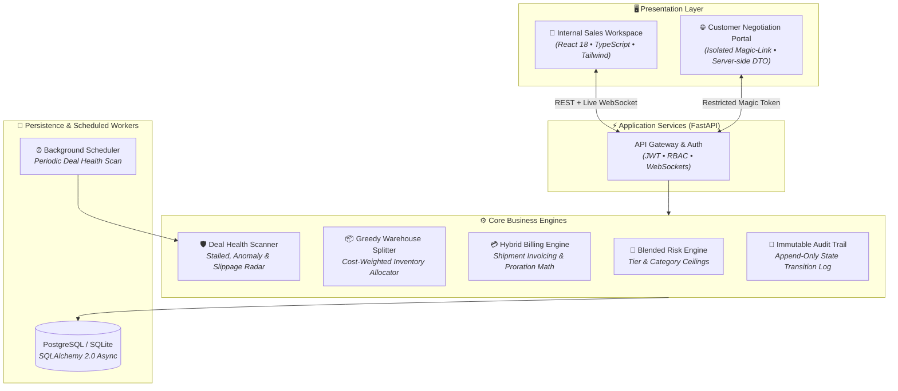

# <div align="center">⚡ DealFlow360</div>

<div align="center">

### **Self-Governing Sales Operations Engine**
*Quote → Approval → Greedy Fulfillment → Hybrid Billing → Customer Negotiation → Deal Health*

[](https://fastapi.tiangolo.com)
[](https://reactjs.org)
[](https://www.typescriptlang.org/)
[](https://tailwindcss.com/)
[](https://www.postgresql.org/)
[](https://www.docker.com/)
[-success?style=for-the-badge&logo=pytest&logoColor=white)](https://docs.pytest.org)
[](LICENSE)

</div>

---

## 📌 Overview

**DealFlow360** is an enterprise-grade sales-ops platform designed to eliminate margin leakage, automate inventory-constrained fulfillment, handle hybrid one-time + subscription billing, and facilitate live customer price negotiations in a secure, isolated portal.

```
                  ┌─────────────────────────────────────────────────────────┐
                  │                 DealFlow360 Lifecycle                   │
                  └─────────────────────────────────────────────────────────┘
   1. Dynamic Quote ────► 2. Blended Risk ────► 3. Approval Flow ────► 4. Customer Portal
   (Live Margin Chips)    (Strictest Ceiling)   (L1 / L2 Hierarchy)   (Live Counter-Offer)
                                                                               │
   6. Deal Health Radar ◄─── 5. Hybrid Billing ◄─── 4. Greedy Split ◄──────────┘
   (WebSocket Anomaly)       (Invoice per Dispatch)  (Cost-Weighted Multi-Depot)
```

---

## 🏗️ 1. System Architecture



### 🔒 Strict Customer Portal Isolation
The customer portal operates on a dedicated route group (`/portal?token=...`) with strict server-side response models (`PortalQuotationOut`). Cost prices, rep margins, internal approval thresholds, and audit notes are stripped **on the backend** and never transmitted over the wire.

---

## ⚙️ 2. Core Business Logic Engines

### 🎯 2.1 Blended Discount Risk Scoring
Evaluates every quote line against the stricter ceiling between customer tier limits and product category rules:

$$\text{Allowed Ceiling} = \min(\text{Tier Ceiling}, \text{Category Ceiling})$$

$$\text{Line Excess} = \max(0, \text{Line Discount} - \text{Allowed Ceiling})$$

$$\text{Max Excess} = \max(\{\text{Line Excess}_i\}), \quad \text{Total Excess} = \sum \text{Line Excess}_i$$

* 🟢 **NONE (Auto-Approved)**: All lines within allowable limits.
* 🟡 **MEDIUM (L1 Routing)**: $\text{Max Excess} \le 5\%$ $\rightarrow$ Auto-routes to **Sales Manager**.
* 🔴 **HIGH (L2 Routing)**: $\text{Max Excess} > 5\%$ or $\text{Total Excess} > 8\%$ $\rightarrow$ Escalates to **Sales Manager + Finance VP**.

---

### 📦 2.2 Cost-Weighted Greedy Multi-Warehouse Split
Fulfills orders across distributed warehouses while minimizing courier freight costs:

1. **Single-Depot Pass**: Checks active depots sorted by `shipping_cost_weight ASC`. If any single warehouse can fulfill 100% of physical units, the order is fulfilled in **1 shipment** to minimize freight.
2. **Greedy Multi-Depot Pass**: If no single warehouse has sufficient stock, the engine greedily draws available inventory $(\text{qty\_available} - \text{qty\_reserved})$ from the cheapest depot first.
3. **Backorder Tracking**: Any shortfall is cleanly allocated to `BackorderLine` with one-click backorder consolidation upon replenishment.

---

### 💳 2.3 Hybrid Billing & Mid-Cycle Proration
* **Milestone Rule**: Physical hardware is strictly invoiced **upon dispatch**, preventing billing disputes on unfulfilled orders.
* **Mid-Cycle Proration Math**: When subscription seats or tiers change mid-period:

$$\text{Daily Rate} = \frac{\text{Plan Price}}{\text{Cycle Days}}$$

$$\Delta_{\text{Proration}} = (\text{Daily Rate}_{\text{new}} - \text{Daily Rate}_{\text{old}}) \times \text{Days}_{\text{remaining}}$$

Positive delta generates an incremental invoice charge; negative delta issues a customer credit note.

---

### 🛡️ 2.4 Deal Health & Anomaly Scanner
Proactively alerts sales leadership via real-time WebSocket push across 3 key risk dimensions:
* ⏳ **Stalled Deals**: Inactive for $\ge 7$ days in draft, approval, or negotiation.
* ⚠️ **Discount Anomalies**: Quotation discount exceeds $1.4\times$ the rep's historical trailing average.
* 🚚 **Logistics Slippage**: Fulfillment orders exceeding estimated ship date (`est_ship_date`) without dispatch.

---

## 🚀 3. Quick Test Flow Walkthrough (8-Step Verification)

Every step of the sales lifecycle is verified end-to-end in automated integration tests:

| Step | Lifecycle Stage | System Action & Verification | Status |
| :---: | :--- | :--- | :---: |
| **1** | **Authentication & Config** | Seed config verified: Enterprise (15%), SMB (5%), depots, catalog. | `PASSED` |
| **2** | **Over-Limit Discount Quote** | Line discount exceeds allowed ceiling $\rightarrow$ flagged **OVER (+8%)** immediately. | `PASSED` |
| **3** | **Blended Risk Evaluation** | Deal evaluated as **HIGH RISK** $\rightarrow$ auto-routed to Manager & Finance. | `PASSED` |
| **4** | **Upsell Margin Feedback** | Recommended accessory added $\rightarrow$ order total & gross margin dynamically update. | `PASSED` |
| **5** | **Multi-Warehouse Allocation** | Order for 10 units splits greedily: **4 from Chicago + 6 from NYC depot**. | `PASSED` |
| **6** | **Hybrid Billing Separation** | One-time hardware & recurring SaaS subscriptions invoiced independently. | `PASSED` |
| **7** | **Portal Counter-Negotiation** | Customer counters with 18% discount in `/portal` $\rightarrow$ auto-re-triggers approval. | `PASSED` |
| **8** | **Dispatch & Payment Reconcile** | Warehouse dispatch generates invoice; recording payment marks invoice **PAID**. | `PASSED` |

---

## 🔑 4. Demo Login Credentials

The local database bootstrap comes pre-seeded with ready-to-test personas:

| Role | Email | Password | Access Scope |
| :--- | :--- | :--- | :--- |
| **Admin** | `admin@dealflow360.com` | `admin123` | System Rules, Discount Ceilings, Warehouse Matrix |
| **Sales Rep** | `rep@dealflow360.com` | `rep123` | Quote Builder, Pipeline Kanban, Upsell Suggestions |
| **Approver** | `approver@dealflow360.com` | `approver123` | Approvals Inbox (L1 Manager / L2 Finance sign-off) |
| **Fulfillment** | `ops@dealflow360.com` | `ops123` | Warehouse Allocations, Dispatching, Backorder Queue |
| **Customer Portal** | *Magic Link Token* | *None (Token)* | Isolated Negotiation, Counter-Proposal, Countersigning |

---

## 💻 5. Getting Started

### Option A: Fast Local Startup (Zero Extra Setup)
Requires Python 3.10+ and Node.js 18+.

```bash
# Clone the repository
git clone https://github.com/MSGitHub127/DealFlowTeam823.git
cd DealFlowTeam823

# Windows (starts backend & frontend concurrently)
start.bat

# Linux / macOS
chmod +x start.sh
./start.sh
```

* 🖥️ **Internal Sales Workspace**: [http://localhost:5173](http://localhost:5173)
* 🌐 **Customer Portal Demo**: [http://localhost:5173/portal?token=portal-acme-gold-token-12345](http://localhost:5173/portal?token=portal-acme-gold-token-12345)
* 📚 **Interactive Swagger Docs**: [http://localhost:8000/docs](http://localhost:8000/docs)

---

### Option B: Docker Compose (PostgreSQL 16 + FastAPI + Vite)

```bash
# 1. Prepare environment
cp .env.example .env

# 2. Launch container stack
docker compose up --build
```
> The backend container automatically runs `alembic upgrade head` before starting the server, provisioning tables directly from versioned migrations.

---

## 🧪 6. Automated Testing

Run the full end-to-end integration test suite:

```bash
cd backend
python -m pytest -v tests/test_quick_flow.py
```

```
tests/test_quick_flow.py::test_step_1_auth_and_config PASSED             [ 14%]
tests/test_quick_flow.py::test_step_2_and_3_over_discount_auto_approval PASSED [ 28%]
tests/test_quick_flow.py::test_step_4_upsell_margin_update PASSED        [ 42%]
tests/test_quick_flow.py::test_step_5_approval_and_multi_warehouse_split PASSED [ 57%]
tests/test_quick_flow.py::test_step_6_hybrid_billing_separation PASSED   [ 71%]
tests/test_quick_flow.py::test_step_7_portal_counter_discount_auto_re_approval PASSED [ 85%]
tests/test_quick_flow.py::test_step_8_payment_and_invoice_update PASSED  [100%]

============================== 7 passed in 15.11s ==============================
```

---

## 📁 7. Project Structure

```
DealFlow360/
├── backend/
│   ├── alembic/                # Versioned SQL migrations
│   ├── app/
│   │   ├── config.py           # Pydantic settings & env validation
│   │   ├── database.py         # Dual-dialect SQLAlchemy 2.0 async engine
│   │   ├── main.py             # FastAPI app entry & WebSocket manager
│   │   ├── seed.py             # Demo users & product catalog seeder
│   │   ├── core/               # Business logic engines (Risk, Split, Proration)
│   │   ├── models/             # Declarative ORM models
│   │   ├── routers/            # 12 modular REST & WebSocket routers
│   │   └── schemas/            # Pydantic v2 validation DTOs
│   └── tests/                  # Pytest async verification suite
├── frontend/
│   ├── src/
│   │   ├── components/         # Glassmorphism Navbar, KPI Cards, Steppers
│   │   ├── hooks/              # useDealFlowSocket real-time sync hook
│   │   ├── pages/              # 18-screen workspace & customer portal
│   │   └── services/           # Axios API client & endpoints
│   ├── tailwind.config.js      # Minimal, sleek modern theme
│   └── vite.config.ts          # Fast build bundler
├── docker-compose.yml          # Postgres 16 + FastAPI + Vite stack
├── package.json                # Root orchestrator scripts (dev, test, build)
├── start.bat                   # 1-click Windows runner
└── start.sh                    # 1-click Linux/macOS runner
```

---

## 📄 License
This project is licensed under the MIT License — see the [LICENSE](LICENSE) file for details.
